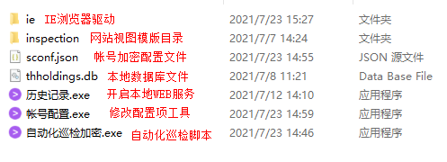
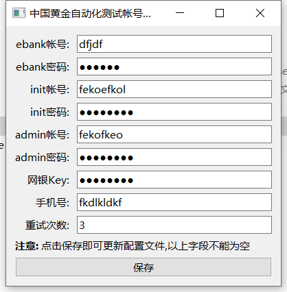
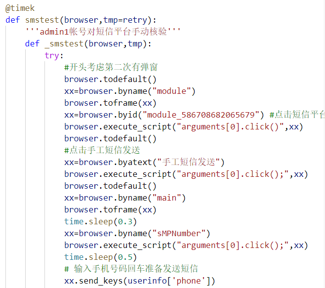

# 自动化文档说明

2021年7月29日 09:51:44

> 最终成品内容在dist目录内

- 自动化巡检加密.exe是打包好的自动化运行脚本====源文件chinagold.py
- 帐号修改加密.exe 是打包好的qt图形化修改密码的程序=====源文件confexe.py
- 历史查询.exe 是一个可以自动弹窗浏览器并查看历史数据库的网站====源文件flask_gold.py
- ie是ie浏览器驱动
- inspection目录是web模版目录

打包的信息可以查看xxx.spec


给用户配置直接复制dist目录到客户机上去运行就可以,注意web网页不支持IE浏览器

> 解决方案是要么找到客户的chrome浏览器路径直接os.system的方式去打开,要么调用webbrowser调用默认浏览器,但是需要设置默认浏览器为非IE浏览器


## 项目目录[dist]




> 文件说明
- inspection 是html模版目录
- sconf.json 是加密后的项目配置文件
- chinagold.db 是本地sqlite数据库
- 历史查询是开启web服务并打开浏览器[pyweb虚拟环境]
- 帐号配置.exe是读取修改加密sconf.json配置文件[qtgui]
- 自动化巡检是巡检之前的自动化操作[dabao]
## 首页预览


## 接口规范


## 修改帐号配置



## 主要使用selenium

自动点击网页继而判断网页元素进行的一种自动化工具,目前主文件是chinagold.py,今天要做最后返回结果的json格式转换为保存数据库的格式,执行到最后保存到本地sql数据库中

**注意我改写简化了selenium的查找元素函数,可点击函数直接追踪到文件位置,此代码只能在trinity电脑运行,或者打包exe在其他电脑运行.**




如果更换了电脑需要按照此电脑的简写规则去改写selenium源码,或者将byid()还替换为find_element_by_id()这种原始函数,功能都一样,只是名字不同罢了


chinagold20210624是之前的备份,该文件针对之前做了os(html)和部署简单的flask打开网页结果的工具


## flask_sqlite/flask单文件/flask_gold.py

    此文件集成了flask的mtv,并引入sqlite本地数据库并且可以打包成exe使用.


```python
# 重要函数,用来兼容py代码和打包为exe都能在同级找到数据库和模版文件
def cur_dir():
    """不论exe还是py代码,都返回当前同级目录"""
    if hasattr(sys,"frozen"):#exe有这个属性
        return os.path.dirname(sys.executable)
    return os.path.dirname(__file__)
```

打包命令:

    pyinstaller -F chinagold.py -i n2.ico

## 将flask应用部署到web服务器

- 先安装gunicorn

    pip install gunicorn

- 后台启动flask应用.

    gunicorn --daemon -w 4 -b 127.0.0.1:5000 manage:app

- 后台启动好了,就可以在nginx部署一个网站 book.xxx.com

    修改book.xxx.com.conf的nginx配置文件

```nginx
server {
    listen 80;
    server_name book.xxx.com; # 这是HOST机器的外部域名，用地址也行

    location / {
        proxy_pass http://127.0.0.1:8080; # 这里是指向 gunicorn host 的服务地址
        proxy_set_header Host $host;
        proxy_set_header X-Forwarded-For $proxy_add_x_forwarded_for;
    }

  }
```
- 重启nginx

    lnmp nginx restart
    或service nginx restart


## 将gunicorn作为服务运行


centos其实也很简单,在/etc/rc.local中添加gunicorn的命令就行

注意upstart是ubuntu系统的开机启动软件,所以下面不适应centos

    这是最后一步,我们再次将采用upstart配置Flask程序作为服务程序在linux运行.首先建立启动配置文件

    nano /etc/init/myflask.conf
    # nano和vi差不多都是文本编辑器

在文件myflask.conf中加入如下的代码:

```python
description "the flask service"

start on runlevel [2345]
stop on runlevel [!2345]

respawn 
setuid root #设置用户id
setgid www-data # 设定组id

env PATH=/home/nigud/gitbook/beibq/venv/bin #定义虚拟python的路径
# 自己服务器不用虚拟用的/usr/local/bin/python3.6 
chdir /var/www/myflask/   #项目路径

exec gunicorn -w 4 -b 127.0.0.1:5000 manage:app
```

- 启动flask服务

    service myflask start

## 更新加密配置功能

2021年7月22日 18:31:24

把chinagold.py自动化脚本做成可配置帐号文件的加密,读取和写入都直接读取二进制文件,防止帐号密码隐私外泄.

做好重新打包exe即可,对应图形化exe程序也要对应的做下加密更新.

key = 'facd81g656fcd8p7a7lkh6dfa81g8hik'

iv='0987654321poilkj'


## 其他备注

本目录有用的py文件其实也就chinagold.py/confexe.py/flask_gold.py/aesconf.py这么几个文件,其他基本都是测试代码运行或之前废弃的版本文件,可以直接放到其他文件夹让文件整洁,我之所以没有整理是想着放这里让后人看看工作流程,明白一些功能是怎么实现渐进的.感觉杂乱的话可以直接删除或者移动到其他目录.