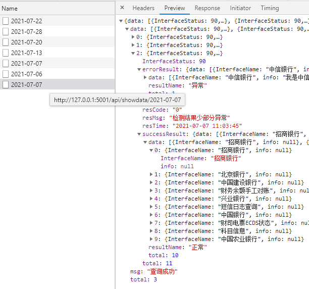

# 清华财务自动化文档说明

为了隐私这里只展示部分代码作为展示

## 首页预览


## 接口规范




## 文件日志

- chinagold.py 中国黄金自动化巡检脚本
- flask_gold.py 历史记录溯源查询
- first.py   帐号配置图形化修改
- Ui_untitled.py  pydesigner生成的ui脚本

2021年7月6日 09:50:19

打算把thholdings.py 做成类似中国黄金的那种,自动化就只搞自动化,之后做个flask_th单文件web服务器来访问历史数据,再搞个图形化来修改帐号配置


# 中国黄金自动化巡检项目
内容在dist目录内

- 历史查询是flask_gold.py开启web服务并打开浏览器[pyweb虚拟环境]
- 帐号配置.exe是修改conf.json配置文件[qtgui]
- 自动化巡检是巡检之前的自动化操作[dabao]
## 主要使用selenium
自动点击网页继而判断网页元素进行的一种自动化工具,目前主文件是chinagold.py,今天要做最后返回结果的json格式转换为保存数据库的格式,执行到最后保存到本地sql数据库中

chinagold20210624是之前的备份,该文件针对之前做了os(html)和部署简单的flask打开网页结果的工具


## flask_sqlite/flask单文件/flask_gold.py

    此文件集成了flask的mtv,并引入sqlite本地数据库并且可以打包成exe使用.


```python
# 重要函数,用来兼容py代码和打包为exe都能在同级找到数据库和模版文件
def cur_dir():
    """不论exe还是py代码,都返回当前同级目录"""
    if hasattr(sys,"frozen"):#exe有这个属性
        return os.path.dirname(sys.executable)
    return os.path.dirname(__file__)
```

打包命令:

    pyinstaller -F chinagold.py -i n2.ico

## 将flask应用部署到web服务器

- 先安装gunicorn

    pip install gunicorn

- 后台启动flask应用.

    gunicorn --daemon -w 4 -b 127.0.0.1:5000 manage:app

- 后台启动好了,就可以在nginx部署一个网站 book.xxx.com

    修改book.xxx.com.conf的nginx配置文件

```nginx
server {
    listen 80;
    server_name book.xxx.com; # 这是HOST机器的外部域名，用地址也行

    location / {
        proxy_pass http://127.0.0.1:8080; # 这里是指向 gunicorn host 的服务地址
        proxy_set_header Host $host;
        proxy_set_header X-Forwarded-For $proxy_add_x_forwarded_for;
    }

  }
```
- 重启nginx
    lnmp nginx restart
    或service nginx restart


## 将gunicorn作为服务运行


centos其实也很简单,在/etc/rc.local中添加gunicorn的命令就行

注意upstart是ubuntu系统的开机启动软件,所以下面不适应centos

    这是最后一步,我们再次将采用upstart配置Flask程序作为服务程序在linux运行.首先建立启动配置文件

    nano /etc/init/myflask.conf
    # nano和vi差不多都是文本编辑器

在文件myflask.conf中加入如下的代码:

```python
description "the flask service"

start on runlevel [2345]
stop on runlevel [!2345]

respawn 
setuid root #设置用户id
setgid www-data # 设定组id

env PATH=/home/nigud/gitbook/beibq/venv/bin #定义虚拟python的路径
# 自己服务器不用虚拟用的/usr/local/bin/python3.6 
chdir /var/www/myflask/   #项目路径

exec gunicorn -w 4 -b 127.0.0.1:5000 manage:app
```

- 启动flask服务

    service myflask start

